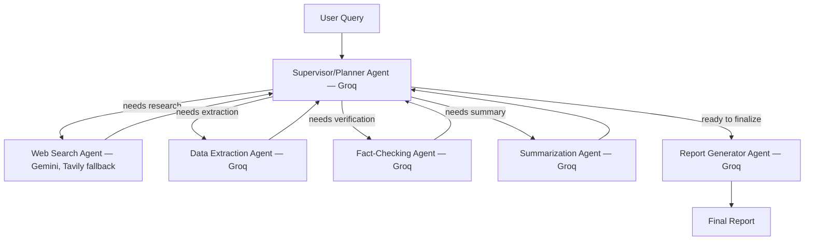

# System Architecture

```mermaid

graph TD
    A[User Query] --> B[Supervisor/Planner Agent — Groq]
    B -->|needs research| C[Web Search Agent — Gemini, Tavily fallback]
    B -->|needs extraction| D[Data Extraction Agent — Groq]
    B -->|needs verification| E[Fact-Checking Agent — Groq]
    B -->|needs summary| F[Summarization Agent — Groq]
    B -->|ready to finalize| G[Report Generator Agent — Groq]
    C --> B
    D --> B
    E --> B
    F --> B
    G --> H[Final Report]

```
